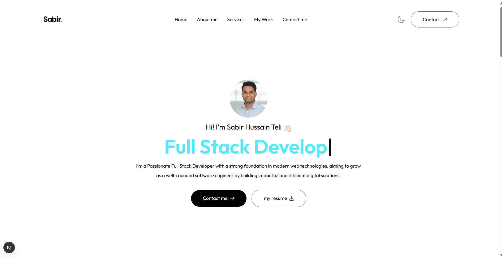

# 🧑‍💻 Developer Portfolio Website

A modern, responsive personal portfolio built with **Next.js 15**, **Tailwind CSS**, and **Framer Motion**. It showcases my work, skills, and services, while offering smooth animations and a dark/light theme toggle for enhanced user experience.

---

## 🔗 Live Demo

👉 [View Portfolio]((https://personal-portfolio-sepia-kappa-15.vercel.app/))  

---

## 🚀 Features

- ✅ Fully responsive layout for all devices
- 🎨 Dark / Light mode toggle (`next-themes`)
- 🔁 Smooth scroll and animation effects (Framer Motion)
- 📱 Mobile navigation menu with slide-in animation
- 🖼️ Custom Google Fonts via `next/font`
- 🧠 Sections: Home, About Me, Services, Work, Contact
- 🌐 SEO-ready metadata configuration

---

## 🛠 Tech Stack

| Technology                                                                          | Usage                           |
| ----------------------------------------------------------------------------------- | ------------------------------- |
| [Next.js 15](https://nextjs.org/)                                                   | React framework with App Router |
| [Tailwind CSS](https://tailwindcss.com/)                                            | Utility-first CSS styling       |
| [Framer Motion](https://www.framer.com/motion/)                                     | Animations and transitions      |
| [next-themes](https://github.com/pacocoursey/next-themes)                           | Theme toggling support          |
| [next/font](https://nextjs.org/docs/app/building-your-application/optimizing/fonts) | Optimized font loading          |

---

## ⚙️ Getting Started

Clone the project and run it locally.

```bash
# Clone the repo
git clone https://github.com/your-username/your-portfolio.git

# Navigate to project directory
cd your-portfolio

# Install dependencies
npm install

# Start the development server
npm run dev


## 📁Folder Structure

  ● /app → App router pages
  ● /components → Reusable UI components (NavBar, Footer, etc.)
  ● /assets → Images and icons
  ● /styles → Global CSS (Tailwind config, custom styles)
  ● /public → Static files

## 🤝 Contributing

Contributions, suggestions, or improvements are always welcome!

- Fork the repo
- Create your feature branch (git checkout -b feature/awesome-feature)
- Commit your changes (git commit -m 'Add awesome feature')
- Push to the branch (git push origin feature/awesome-feature)
- Open a pull request

---

## 📄 License

This project is licensed under the [MIT License](LICENSE).

---

## 🙋‍♂️ Author

**[Sabir Hussain](https://www.linkedin.com/in/sabirhussainteli)**   
[LinkedIn](https://www.linkedin.com/in/sabirhussainteli) | [GitHub](https://github.com/Sabirrh)

---

# My Personal Portfolio Screenshot



